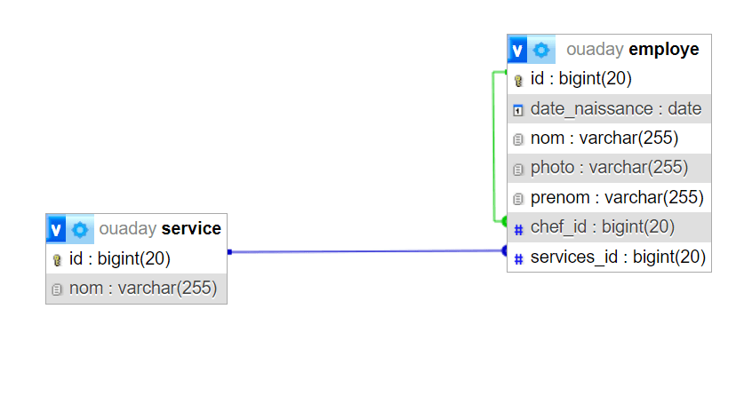
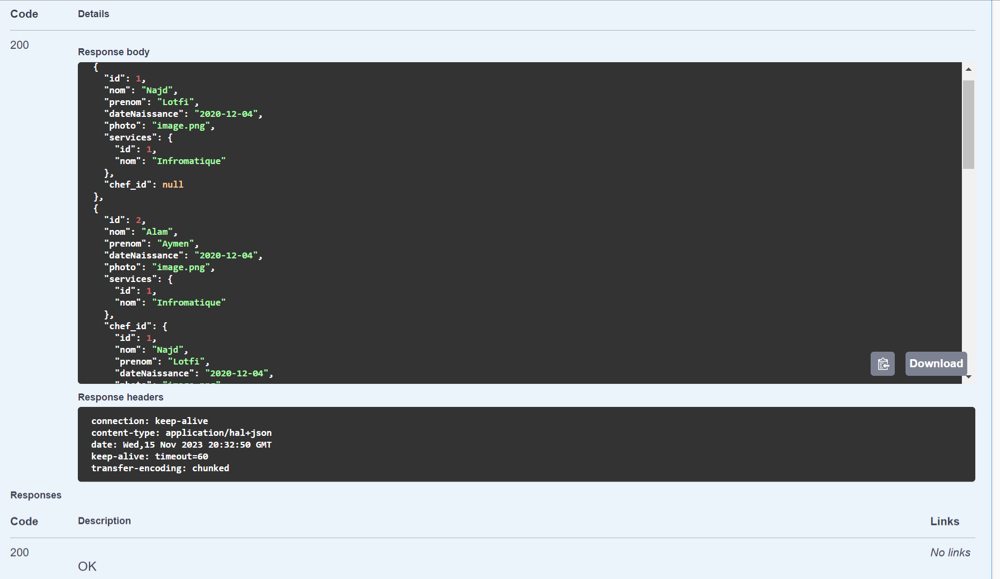
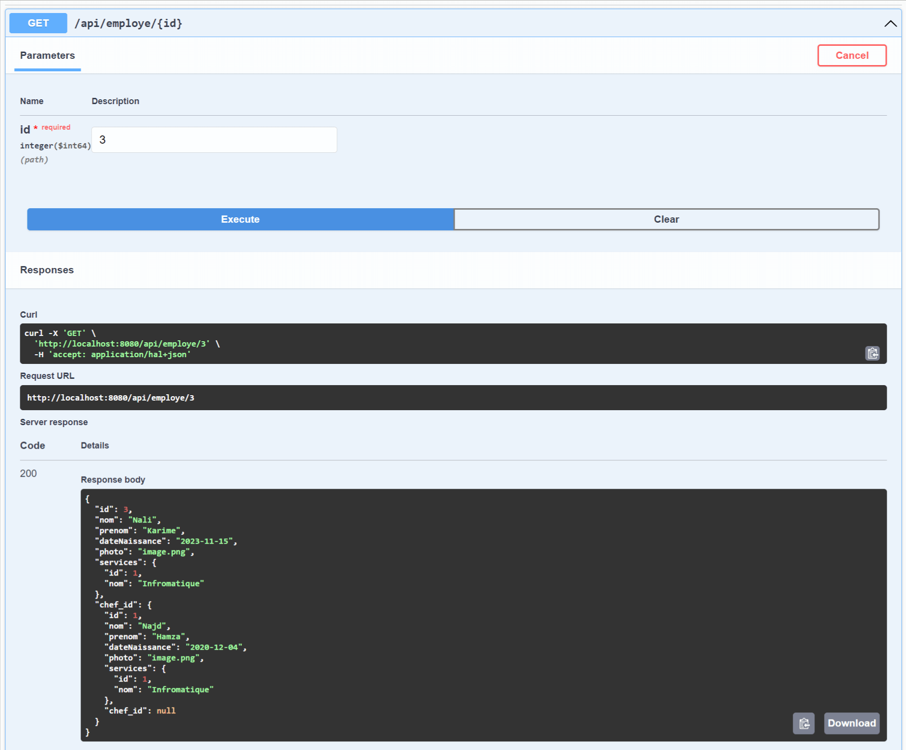
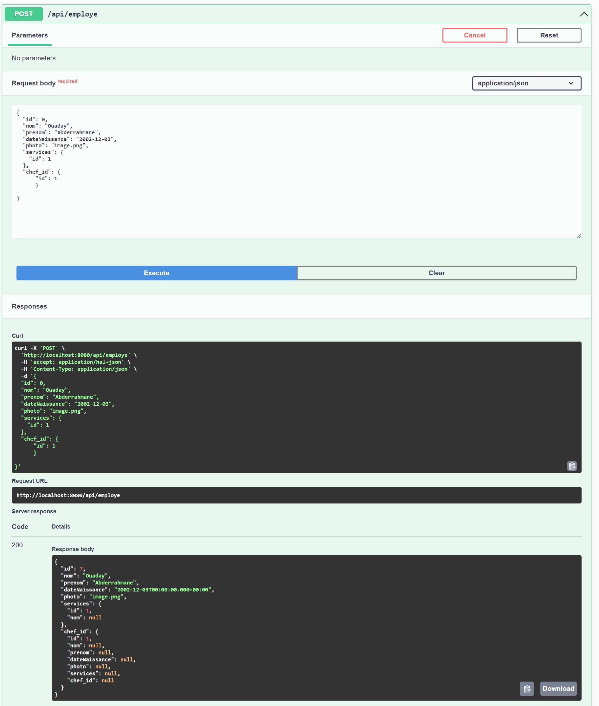
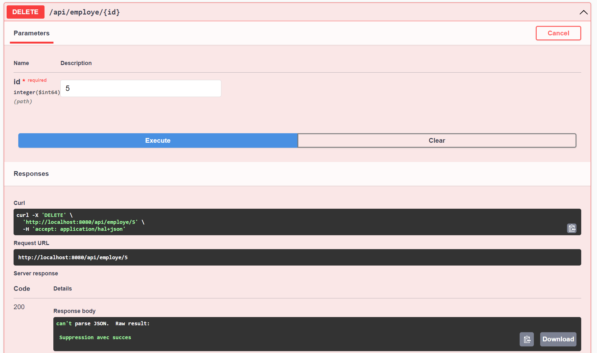
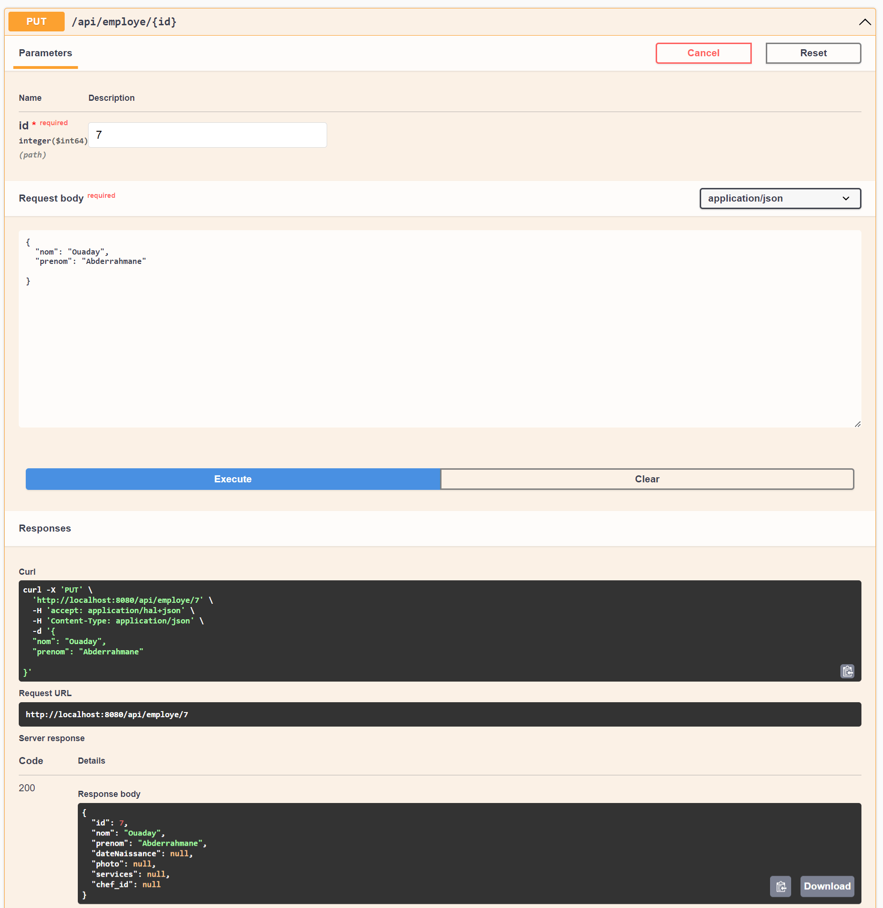
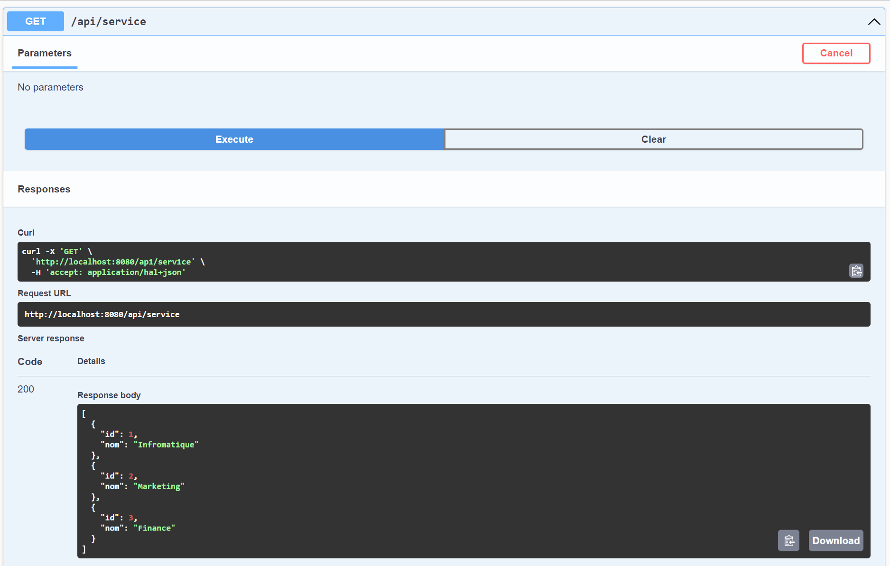
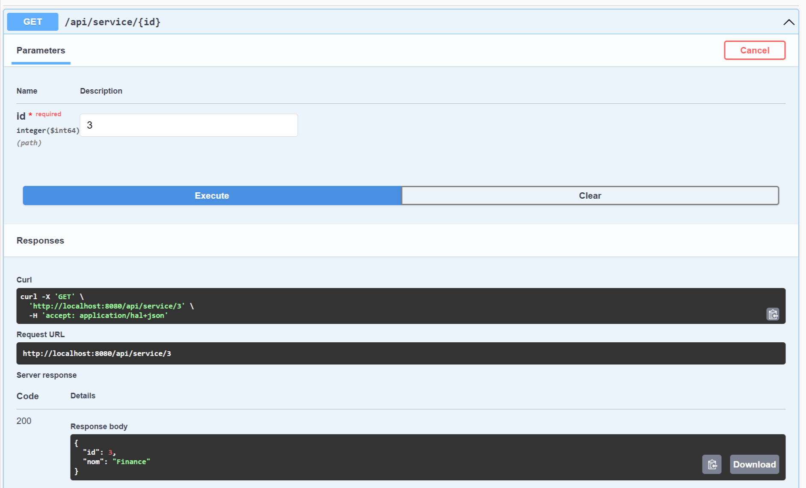
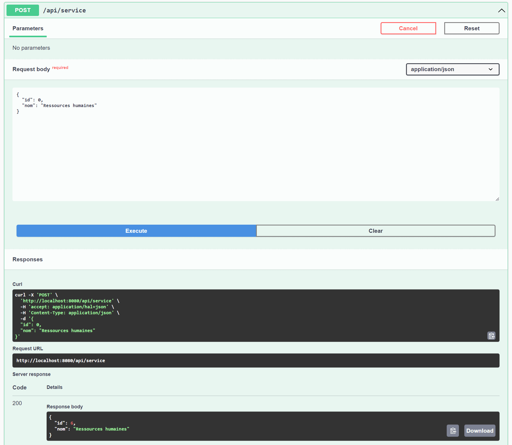
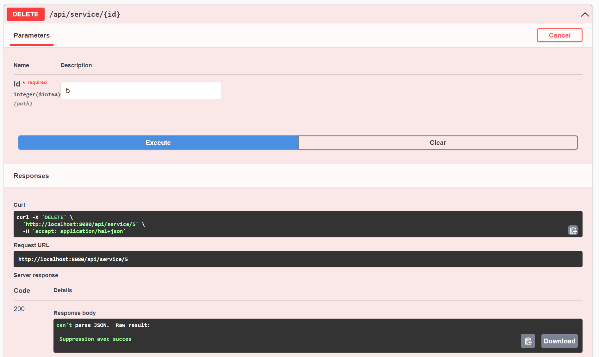

# Examen avec Spring Boot

# Base de données

# Employe
### 1. Afficher la liste des employes

### 2. Afficher employe par ID

### 3. Ajouter un employe

### 4. Supprimer un employe

### 5. Modifier un employe

# Service
### 1. Afficher la liste des services

### 2. Afficher service par ID

### 3. Ajouter un service

### 4. Supprimer un service

### 5. Modifier un service

